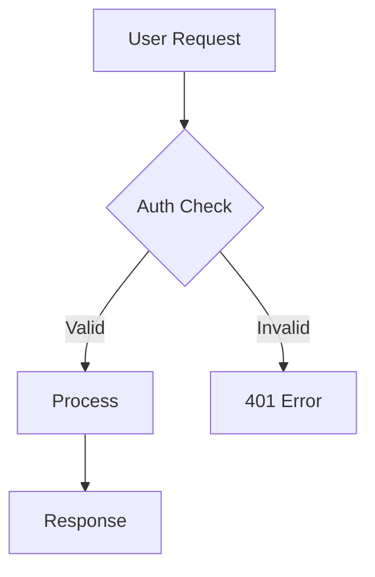

# Diagrams

Create any kind of diagram or visual. Two engines are always available — the skill routes to the right one based on what you ask for.

## Routing

| You say... | Engine | Why |
|-----------|--------|-----|
| "create a flowchart" | **Excalidraw** | Structural, editable |
| "draw an architecture diagram" | **Diagram Forge** | Polished, presentation-grade |
| "flowchart with Excalidraw" | **Excalidraw** | Explicit request |
| "flowchart with Diagram Forge" | **Diagram Forge** | Explicit request |
| "create an infographic" | **Diagram Forge** | Visual content, branded |
| "create a blueprint" | **Diagram Forge** | Detailed visual |
| "sketch the data flow" | **Excalidraw** | Quick structural diagram |
| "sequence diagram" | **Excalidraw** | Standard UML type |
| "product roadmap graphic" | **Diagram Forge** | Presentation visual |
| "ER diagram" | **Excalidraw** | Data model, structural |
| "executive summary visual" | **Diagram Forge** | External audience |
| "component diagram" | **Excalidraw** | Structural, editable |

**Default rule:** If the intent is structural/schematic → Excalidraw. If the intent is visual/polished/branded → Diagram Forge. If the user names a specific engine, use that one.

## Excalidraw Architect

Free, instant, editable `.excalidraw` output. Sugiyama auto-layout engine handles positioning — never specify coordinates manually.

### Tools

| Tool | Use |
|------|-----|
| `create_diagram` | New diagram from structured nodes + connections |
| `mermaid_to_excalidraw` | Convert Mermaid syntax to Excalidraw |
| `modify_diagram` | Edit an existing diagram |
| `get_diagram_info` | Inspect diagram structure |

### Two Ways to Create

**Structured input** — describe nodes and connections. Best for architecture and component diagrams. The auto-layout engine positions everything.

**Mermaid input** — write Mermaid syntax and convert. Often fastest for flowcharts, sequences, and ER diagrams. Claude knows Mermaid syntax well:

### Output

`.excalidraw` files saved to the project directory. View in:
- VS Code Excalidraw extension
- excalidraw.com (drag file)
- Any Excalidraw-compatible tool

### Strengths

- Free (no API calls)
- Instant generation
- Editable after creation
- Auto-layout prevents overlapping elements
- 50+ technology component styles (Kafka, Redis, Postgres, K8s, etc.)

## Diagram Forge

AI-generated presentation-grade visuals. Costs ~$0.01-0.04 per image.

### Templates

| Template | Use Case |
|----------|----------|
| architecture | System architecture |
| c4_container | C4 model containers |
| component | Component/module diagrams |
| data_flow | Data pipeline visuals |
| sequence | Interaction sequences |
| integration | System integration |
| infographic | Data-driven infographics |
| exec_infographic | Executive summary visuals |
| product_roadmap | Timeline roadmaps |
| brand_infographic | Branded visual content |
| workstreams | Project workstream views |
| kanban | Board visualizations |
| generic | Custom visuals |

### Providers

| Provider | Model | Cost | Notes |
|----------|-------|------|-------|
| Gemini (default) | gemini-3.1-flash-image | ~$0.039 | Fast, good quality |
| Gemini Pro | gemini-3-pro-image | ~$0.039 | Best text rendering |
| OpenAI | gpt-image-1.5 | $0.011-0.032 | Alternative style |

### Output

PNG images. High-resolution, presentation-ready.

### Strengths

- Polished, professional output
- Brand styling and custom visual design
- Template system for consistent quality
- Multiple AI providers for different styles

## Important Notes

- **Both engines are always available** — no setup needed per project
- **Excalidraw = free, Diagram Forge = paid per image** — route accordingly
- **Don't manually specify coordinates** for Excalidraw — always use auto-layout
- **Mermaid is the fast path** for standard diagram types with Excalidraw
- **Style references** are available for Diagram Forge — consistent visual identity across diagrams
